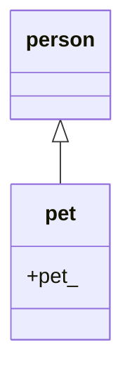

# Entity ontology

_Generated at 2026-07-15T22:56:13.410013Z by `make ontology`. Edit [`data/ontology.yaml`](../data/ontology.yaml) and [`data/references/relation_types.yaml`](../data/references/relation_types.yaml), then regenerate._

The archive models Malice Mizer research data as a typed entity graph. This document shows the **type-level** relationships (ontology), not individual entity instances.

## Entity types

| Type | Label | Prefix | Category | Subtype of |
|------|-------|--------|----------|------------|
| `album` | Album | `album_` | release | — |
| `appearance` | Appearance | `appearance_` | appearance | — |
| `article` | Article | `article_` | press | — |
| `concert` | Concert | `concert_` | concert | — |
| `image` | Image | `image_` | media | — |
| `organization` | Organization | `org_` | meta | — |
| `person` | Person | `person_` | person | — |
| `pet` | Pet | `pet_` | person | `person` |
| `reference` | Reference | `ref_` | press | — |
| `single` | Single | `single_` | release | — |
| `song` | Song | `song_` | song | — |
| `venue` | Venue | `venue_` | meta | — |
| `video` | Video | `video_` | media | — |

**13** entity types defined.

### Subtypes

## Relations

| Relation | Label | Domain → Range | Origin | Status |
|----------|-------|----------------|--------|--------|
| `aired` | Aired | organization → appearance | derived | active |
| `appeared_at` | Appeared at | person → appearance | derived | active |
| `appeared_with` | Appeared with | person → pet | derived | active |
| `appears_on` | Appears on | song → album, single | derived | active |
| `appears_with` | Appears with | pet → person | derived | active |
| `broadcast_on` | Broadcast on | appearance → organization | derived | active |
| `cited_by` | Cited by | song, album, single, person, concert, appearance, article, video → reference | explicit | active |
| `covers` | Covers | concert, appearance, album, single → song | explicit | planned |
| `credited_on` | Credited on | person → song | derived | active |
| `discusses` | Discusses | reference → song, album, single, person, concert, appearance, article, video | derived, explicit | active |
| `featured_appearance` | Featured appearance | appearance → person | derived | active |
| `features_appearance` | Features appearance performance | appearance → song | derived | active |
| `features_concert` | Features concert performance | concert → song, person | derived | active |
| `has_member` | Has member | organization → person | explicit | active |
| `held_at` | Held at | concert, appearance → venue | derived | active |
| `hosted` | Hosted | venue → concert, appearance | derived | active |
| `includes_article` | Includes article | reference → article | derived | active |
| `includes_song` | Includes song | album, single → song | derived | active |
| `member_of` | Member of | person → organization | explicit | active |
| `owned_by` | Owned by | person → pet | derived | active |
| `owns` | Owns | pet → person | derived | active |
| `performed_at_appearance` | Performed on appearance | song → appearance | derived | active |
| `performed_at_concert` | Performed at concert | song, person → concert | derived | active |
| `personnel` | Personnel credit | song → person | derived | active |
| `photographed_at` | Photographed at | image → concert, appearance, venue | explicit | planned |
| `published_in` | Published in | article → reference | derived | active |
| `references` | References | song, concert, appearance, reference → song, album, single, appearance, venue, concert | explicit | active |
| `related_song` | Related song | song → song | explicit | active |

**26** active relations, **2** planned (defined but not yet used in data).

### Type-level diagram

Solid annotations are explicit-only; `[derived]` edges are inferred from entity fields; `[derived+explicit]` relations can be both inferred and stated in `data/links.yaml`.

```mermaid
erDiagram
    organization ||--o{ appearance : "Aired [derived]"
    person ||--o{ appearance : "Appeared at [derived]"
    person ||--o{ pet : "Appeared with [derived]"
    song ||--o{ album : "Appears on [derived]"
    song ||--o{ single : "Appears on [derived]"
    pet ||--o{ person : "Appears with [derived]"
    appearance ||--o{ organization : "Broadcast on [derived]"
    song ||--o{ reference : "Cited by"
    album ||--o{ reference : "Cited by"
    single ||--o{ reference : "Cited by"
    person ||--o{ reference : "Cited by"
    concert ||--o{ reference : "Cited by"
    appearance ||--o{ reference : "Cited by"
    article ||--o{ reference : "Cited by"
    video ||--o{ reference : "Cited by"
    concert ||--o{ song : "Covers (planned)"
    appearance ||--o{ song : "Covers (planned)"
    album ||--o{ song : "Covers (planned)"
    single ||--o{ song : "Covers (planned)"
    person ||--o{ song : "Credited on [derived]"
    reference ||--o{ song : "Discusses [derived+explicit]"
    reference ||--o{ album : "Discusses [derived+explicit]"
    reference ||--o{ single : "Discusses [derived+explicit]"
    reference ||--o{ person : "Discusses [derived+explicit]"
    reference ||--o{ concert : "Discusses [derived+explicit]"
    reference ||--o{ appearance : "Discusses [derived+explicit]"
    reference ||--o{ article : "Discusses [derived+explicit]"
    reference ||--o{ video : "Discusses [derived+explicit]"
    appearance ||--o{ person : "Featured appearance [derived]"
    appearance ||--o{ song : "Features appearance performance [derived]"
    concert ||--o{ song : "Features concert performance [derived]"
    concert ||--o{ person : "Features concert performance [derived]"
    organization ||--o{ person : "Has member"
    concert ||--o{ venue : "Held at [derived]"
    appearance ||--o{ venue : "Held at [derived]"
    venue ||--o{ concert : "Hosted [derived]"
    venue ||--o{ appearance : "Hosted [derived]"
    reference ||--o{ article : "Includes article [derived]"
    album ||--o{ song : "Includes song [derived]"
    single ||--o{ song : "Includes song [derived]"
    person ||--o{ organization : "Member of"
    person ||--o{ pet : "Owned by [derived]"
    pet ||--o{ person : "Owns [derived]"
    song ||--o{ appearance : "Performed on appearance [derived]"
    song ||--o{ concert : "Performed at concert [derived]"
    person ||--o{ concert : "Performed at concert [derived]"
    song ||--o{ person : "Personnel credit [derived]"
    image ||--o{ concert : "Photographed at (planned)"
    image ||--o{ appearance : "Photographed at (planned)"
    image ||--o{ venue : "Photographed at (planned)"
    article ||--o{ reference : "Published in [derived]"
    song ||--o{ song : "References"
    song ||--o{ album : "References"
    song ||--o{ single : "References"
    song ||--o{ appearance : "References"
    song ||--o{ venue : "References"
    song ||--o{ concert : "References"
    concert ||--o{ song : "References"
    concert ||--o{ album : "References"
    concert ||--o{ single : "References"
    concert ||--o{ appearance : "References"
    concert ||--o{ venue : "References"
    concert ||--o{ concert : "References"
    appearance ||--o{ song : "References"
    appearance ||--o{ album : "References"
    appearance ||--o{ single : "References"
    appearance ||--o{ appearance : "References"
    appearance ||--o{ venue : "References"
    appearance ||--o{ concert : "References"
    reference ||--o{ song : "References"
    reference ||--o{ album : "References"
    reference ||--o{ single : "References"
    reference ||--o{ appearance : "References"
    reference ||--o{ venue : "References"
    reference ||--o{ concert : "References"
    song }o--o{ song : "Related song"
```

## Labeling fields

Each relation in `relation_types.yaml` supports:

- `label` / `label_ja` — English and Japanese display names
- `domain` / `range` — allowed entity type pairs (enforced by `make entities-validate`)
- `category` / `color` — UI grouping on browse and entity pages
- `examples` — worked instance edges for editors
- `status` — `active` or `planned`

Personnel credits use the `role` sub-label (see `personnel_role` in [`schema/vocabularies.json`](../schema/vocabularies.json)).
